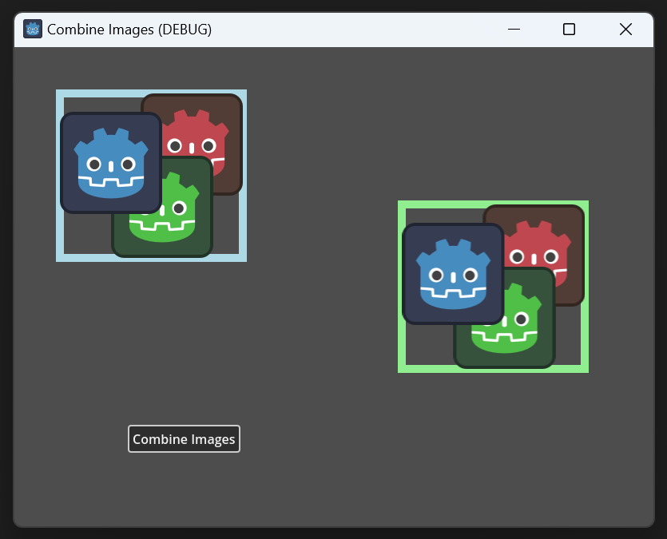

# Godot Combine Images



Combine 3 smaller Sprite2D (left) into a single, bigger sprite (right).

From [CombineImages/scenes/Main/main.gd](CombineImages/scenes/Main/main.gd):

```gdscript
func combine_images(sprites: Array[Sprite2D]) -> void:
    assert(!sprites.is_empty())

    var format := sprites[0].texture.get_image().get_format()
    var bounding_box := calc_bounding_box(sprites)

    assert(sprites.all(func(sprite: Sprite2D) -> bool: return sprite.texture.get_image().get_format() == format))
    assert(bounding_box.size.x > 0 and bounding_box.size.y > 0)

    var image := Image.create(int(bounding_box.size.x), int(bounding_box.size.y), false, format)

    for sprite in sprites:
        image.blend_rect(sprite.texture.get_image(), Rect2i(Vector2i.ZERO, sprite.texture.get_image().get_size()), get_sprite_rect(sprite).position - bounding_box.position)

    var texture := ImageTexture.create_from_image(image)

    if combined_sprite:
        combined_sprite.queue_free()

    combined_sprite = Sprite2D.new()
    combined_sprite.texture = texture
    combined_sprite.position = Vector2(600, 300)
    add_child(combined_sprite)
```
